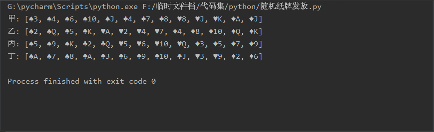
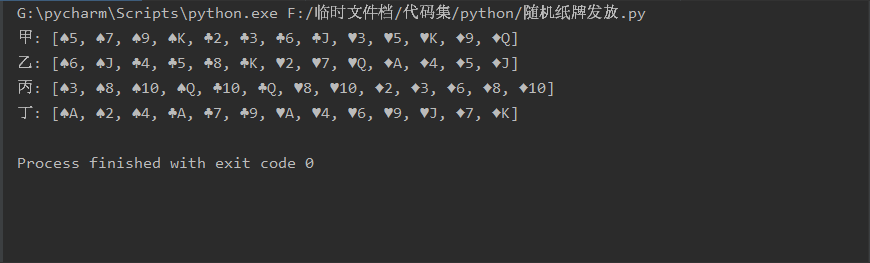

# 何在荣（U201711931）的预习作业
## 1、项目名称：四人纸牌随机发放小程序
在四个人的扑克牌游戏中需要随机将52张牌发给四位玩家，为保持公平，可以通过random()函数来实现随机发牌，从而完成发牌的操作。
## 2、编程思路：借助Python语言进行编程
在Python编辑器中，通过输入命令行pip install ...来加载第三方库，然后定义了三个类，分别是player、poker、card，实现洗牌、发牌等功能，最后将三个类综合起来，编辑主函数，实现随机发牌操作。
## 3、项目运行情况：能够实现随机发牌

